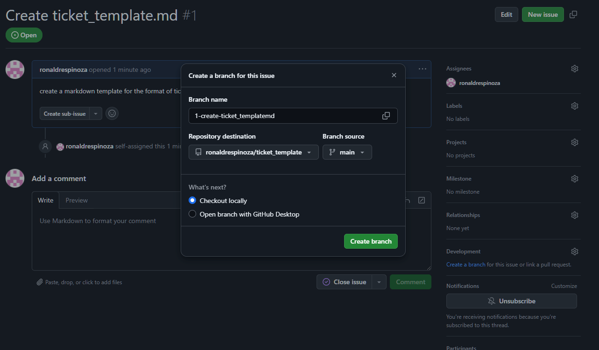

# Use this as a template for filling out tickets associated with a label tag request

## Associated Branches
Which branches were made for this project<br>

[bug/fix_some_issue_branch](theLinkToTheIssue/somepage.html)

You can make your own branch of the format label_branchName<br>
Or you can use the Create a branch for this issue<br>


You can also link a pull request<br>


## Description and Context
In one or two sentences Briefly explain what needs to be done and why<br>

    A pull request in GitHub is a request to merge changes from one branch into another, allowing for code review and collaboration.
    It involves creating a branch, making changes, committing and pushing them, then opening a PR for review and merging into the main branch.

This process is essential for collaborative development because it allows others to understand the goal/objective your work

## Supporting Documentation
Add links to any outside documents that are helpful for either understanding or fixing the issue
* [CPP environment setup for VSCode](https://code.visualstudio.com/docs/cpp/config-msvc#_prerequisites)
* [CPP multithreading tutorial](https://www.tutorialspoint.com/cplusplus/cpp_multithreading.htm)
* [CPP thread safe queue](https://www.geeksforgeeks.org/implement-thread-safe-queue-in-c/)
* [CPP utlizing a queue to split tasks between threads](https://stackoverflow.com/questions/6393156/programming-logic-splitting-up-tasks-between-threads)


 <h4>Original Source Code</h4>

```cpp
#include <iostream>
#include <thread>
#include <queue>
#include <mutex>
#include <condition_variable>

std::queue<int> q;
std::mutex mtx;
std::condition_variable cv;
bool done = false;

// Producer thread function
void producer() {
    for (int i = 0; i < 10; ++i) {
        std::this_thread::sleep_for(std::chrono::milliseconds(100)); // Simulate work
        std::lock_guard<std::mutex> lock(mtx);
        q.push(i);
        std::cout << "Produced: " << i << std::endl;
        cv.notify_one(); // Notify consumer thread
    }
    done = true;
    cv.notify_one(); // Notify consumer that production is done
}

// Consumer thread function
void consumer() {
    while (true) {
        std::unique_lock<std::mutex> lock(mtx);
        cv.wait(lock, []{ return !q.empty() || done; }); // Wait until queue is not empty or done
        if (!q.empty()) {
            int value = q.front();
            q.pop();
            std::cout << "Consumed: " << value << std::endl;
        }
        if (done && q.empty()) {
            break; // Exit if production is done and queue is empty
        }
    }
}

int main() {
    // Create producer and consumer threads
    std::thread producer_thread(producer);
    std::thread consumer_thread(consumer);

    // Wait for threads to finish
    producer_thread.join();
    consumer_thread.join();

    return 0;
}

```

<h3>Question:</h3>

You are working on a C++ simulation engine that requires optimization for multi-threading.<br>
The simulation involves a calculation-heavy task:<br>

 - Design and implement a multithreaded producer-consumer problem using a queue.<br>
 - You are tasked with designing a system to manage car parking in a multi-level parking garage.<br>
 - The garage has a grid layout, where each parking spot can either be occupied or available.<br>
 - The goal is to find the best available parking spot for a car to park, where the "best" spot is defined as the closest one to the elevator.<br>

<h3>Requirements:</h3>

* The provided code illustrates a queue that is shared between two threads: 
    *   A producer thread and a consumer thread.
    *   The producer produces items and pushes them into the queue, while the consumer consumes (or removes) items from the queue.
    *   You must implement this system ensuring that the producer and consumer threads work together safely, and handle situations like the queue being empty or full.
    *   Implement this in C++.

 *   The parking garage has multiple levels, each with a grid of spots.
 *   The elevator is located at a specific spot on the garage grid.
 *   When a new car enters, it needs to be assigned the best available parking spot. The best spot is the one closest to the elevator.
 *   If there are multiple spots that are equidistant from the elevator, the system should select the first available spot (based on row or column order).
 *   You need to handle scenarios where the parking garage may be full or there are no available spots.

 *  Question:
    *   How would you represent the parking garage grid and the spots?
    *   How would you find the closest available spot to the elevator using an efficient algorithm?
    *   How would you update the parking garage after a car parks?
    *   Can you write a function to solve this problem?

* Ensure proper synchronization and thread safety in the multi-threaded implementation. You should particularly consider how to handle synchronizing the particle updates.<br>

- <input type="checkbox"> Benchmark both the single-threaded and multi-threaded versions for different numbers of full spots
  - <input type="checkbox">  10
  - <input type="checkbox">  100
  - <input type="checkbox">  1000
  - <input type="checkbox"> Record the time taken for finding the best spot in each case.<br>

* Describe any challenges or considerations when introducing multi-threading into the engine and propose solutions to address them.<br>

* Create a brief document or presentation that provides an overview of your solution, including key design decisions, benchmark results, and performance analysis.<br>

 *  Follow-up Questions:
    *   How would your approach change if the parking garage is much larger (e.g., millions of spots)?
    *   What if there were multiple elevators or entrances to the garage?
    *   How would you handle edge cases such as a full garage, multiple cars arriving at the same time, or the elevator being blocked?

<h3>Additional Information:</h3>
 
 *  To solve this problem, you need a few key components:

    * Representation of the Garage:

        *   You could represent the parking garage as a 2D grid (a matrix), where each cell represents a parking spot.
        *   The value in each cell can be 0 (available) or 1 (occupied).
        *   The elevator location can be represented as a specific cell in the grid, say (elevator_row, elevator_col).

    * Finding the Closest Available Spot:

        *   The best spot is the one closest to the elevator.
        *   To find this, you can use the Breadth-First Search (BFS) algorithm, which works well for finding the shortest path in an unweighted grid.
        *   BFS explores all neighboring cells level by level, ensuring that when we first reach an available spot, it is the shortest possible distance from the elevator.

    * Updating the Garage After Parking:

        *   Once a car parks in a spot, you mark that spot as 1 (occupied) in the grid.

<h3>Bonus Question: Advanced Algorithm Integration</h3>

 *  The garage grid may be sparse, with many obstacles.
 *  You need to ensure your solution efficiently handles large garages.
 *  Use Dijkstra’s Algorithm to solve this problem.<br>

    - <input type="checkbox"> How would you represent the parking garage, obstacles, and the elevator's position?
    - <input type="checkbox"> How would you use Dijkstra’s algorithm to find the shortest path to the nearest available parking spot?
    - <input type="checkbox"> What data structures would you use for the algorithm?
    - <input type="checkbox"> Can you write the code to implement this solution?


<h3>Please extend your existing solution to include the following:</h3>

* Implement a quadtree data structure to represent the spatial distribution of parking spaces.

* Each quadtree node should contain a subset of parking spaces, and internal nodes should represent larger regions of space.<br>

* Benchmark and compare the performance of the enhanced simulation (with the Dijkstra’s algorithm) against the previous Breadth-First Search (BFS) algorithm.

* Measure the execution time for benchmark test cases listed and report the performance improvements achieved.<br>

<h3>Additional Developer Information:</h3>

* Provide comments or explanations in your code to demonstrate your thought process and understanding of the concepts.<br>

* Include all the code used in your final deliverable.<br>

* Update the brief document or presentation to describe the integration of Dijkstra’s algorithm, any modifications to the code, and the performance analysis.<br>

<h3>Barnes-Hut Algorithm enhanced sim explanation:</h3>

The Barnes–Hut simulation (named after Josh Barnes and Piet Hut) is an approximation algorithm for performing an n-body simulation. It is notable for having order O(n log n) compared to a direct-sum algorithm which would be O(n2) [Barnes–Hut simulation](https://en.wikipedia.org/wiki/Barnes%E2%80%93Hut_simulation)<br>
Some of the most demanding high-performance computing projects do computational astrophysics using the Barnes–Hut treecode algorithm,


## Scope / Requirements

Indicate the exact scope and what is not in the requirements and what may cause this project to be out of bounds

    The objective of this task is to implement an algorithm using Dijkstra's approach to find the shortest path from an elevator to the closest available parking spot in a multi-level parking garage, considering obstacles and ensuring optimal efficiency.

### Acceptance Criteria
Clearly indicate what must be done to consider this issue finished
 * list of tests to satisfy
 * <input type="checkbox">  Benchmark(record the time taken) single-threaded updates for the following number of parking spaces
    * <input type="checkbox"> 10
    * <input type="checkbox">  100
    * <input type="checkbox">  1000
 * <input type="checkbox">  Benchmark(record the time taken) multi-threaded updates for the following number of parking spaces
    * <input type="checkbox"> 10
    * <input type="checkbox">  100
    * <input type="checkbox">  1000
 * <input type="checkbox"> implment the Breadth-First Search (BFS) algorithm utilizing the multithreaded queue
    * <input type="checkbox">  Benchmark(record the time taken) multi-threaded updates for the following number of parking spaces
        * <input type="checkbox"> 10
        * <input type="checkbox">  100
        * <input type="checkbox">  1000
 * <input type="checkbox"> implment Dijkstra’s algorithm utilizing the multithreaded queue
    * <input type="checkbox">  Benchmark(record the time taken) multi-threaded updates for the following number of parking spaces
        * <input type="checkbox"> 10
        * <input type="checkbox">  100
        * <input type="checkbox">  1000


**Accepting Authority**: (@tag authority here)<br>
This is the person who is authorized to call this issue "done" or approves the merge requests however your team works.<br>
@the_person_in_charge

### Scope Clarifications
Clarify what is meant by the above acceptance criteria when not immediately<br>
     clear. Especially clarify what ISN'T covered by this unit of work, to<br>
     prevent scope creep.<br>

Things that would **not** be included in the scope of this task are:

1. **Handling Parking Payment Systems**: The task does not involve integrating or managing any payment or billing systems for parking.
2. **Dynamic Parking Availability Updates**: Real-time updates of parking spot availability based on incoming vehicles or changes in occupancy are not part of this task.
3. **Multiple Elevators or Entrances**: The task assumes only one elevator; handling multiple elevators or entrances with routing logic would be outside the scope.
4. **Advanced Vehicle Types (e.g., electric charging stations)**: The task does not consider the need for specialized spots for electric vehicles or other vehicle types with unique parking requirements.
5. **Vehicle Navigation and Movement**: The task does not include simulating or guiding the car to the parking spot once it's been selected.
6. **Parking Garage Structure Variability**: The task does not require the handling of highly dynamic or complex parking garage designs, like those with non-rectangular grid layouts or elevators with multiple floors.
7. **User Interface or Visualization**: Creating a front-end interface or a visualization for the garage layout is outside the scope of the task. 
8. **Security and Access Control**: Ensuring only authorized vehicles can access certain parking spots or integrating security features is not included.
9. **Real-Time Traffic Analysis**: The task does not involve optimizing parking based on traffic flow or occupancy predictions over time.
10. **Parking Spot Reservation**: Allowing users to reserve parking spots ahead of time is not part of this problem.

## Task Breakdown

Developers this is where you list the steps you took and what issues were encountered 

### Developer Task Breakdown

- <input type="checkbox" checked> **Set Up the Basic Project Structure**
  - <input type="checkbox" > Initialize a C++ project or a new file if working in a single-file structure.
  - <input type="checkbox" > Define the header includes and basic I/O setup.

---

- <input type="checkbox" checked> **Define the Garage Grid Structure**
  - <input type="checkbox" > Create a 2D vector to represent the garage grid, with values representing available spots, obstacles, and the elevator.
  - <input type="checkbox" > Define constants or enums to represent different cell types: available (0), obstacle (1), elevator (2), occupied (3).

---

- <input type="checkbox" > **Implement the Dijkstra’s Algorithm Core Logic**
  - <input type="checkbox" > Create a `Position` struct to store row, column, and distance information.
  - <input type="checkbox" > Set up the priority queue (min-heap) to handle the selection of the closest spot.
  - <input type="checkbox" > Implement the logic to process the grid cells and explore neighboring cells (up, down, left, right).
  - <input type="checkbox" > Ensure that obstacles are avoided and that each cell's distance is properly updated.
  - <input type="checkbox" > Return the shortest path to the closest available spot.

---

- <input type="checkbox" > **Handle Parking Spot Updates**
  - <input type="checkbox" > Define a function to park a car at a specified position in the grid (mark it as occupied).
  - <input type="checkbox" > Update the grid accordingly, changing the spot from `0` (available) to `3` (occupied).

---

- <input type="checkbox" > **Input Handling and Testing Setup**
  - <input type="checkbox" > Implement test cases for the grid with various scenarios: no obstacles, multiple obstacles, no available spots, etc.
  - <input type="checkbox" > Provide a hardcoded input or simulate input for the garage grid and elevator location.
  - <input type="checkbox" > Print the result (distance to the closest spot) for validation.

---

- <input type="checkbox" > **Optimizations and Edge Case Handling**
  - <input type="checkbox" > Ensure edge cases like full garages, grids without available spots, and multiple available spots with the same distance are handled.
  - <input type="checkbox" > Consider the performance of the algorithm on larger grids and optimize if needed.

---

- <input type="checkbox" > **Documentation and Comments**
  - <input type="checkbox" > Add comments to explain key sections of the code (especially the Dijkstra algorithm part).
  - <input type="checkbox" > Write a brief README or code comments to explain how to run the program and what the inputs and outputs are.

---

- <input type="checkbox" > **Final Review and Testing**
  - <input type="checkbox" > Ensure that all functionality works as expected.
  - <input type="checkbox" > Run tests with different grid sizes and configurations to validate the correctness of the algorithm.
  - <input type="checkbox" > Check for performance issues or possible optimizations in edge cases (e.g., large grids, many obstacles).

---

- <input type="checkbox" checked> **Optional Enhancements (Future Work)**
  - <input type="checkbox" checked> Implement dynamic parking updates (real-time updates of spot availability).
  - <input type="checkbox" checked> Add a graphical or user interface for visualizing the parking garage layout.
  - <input type="checkbox" checked> Integrate multiple elevators or entrance options if required.
